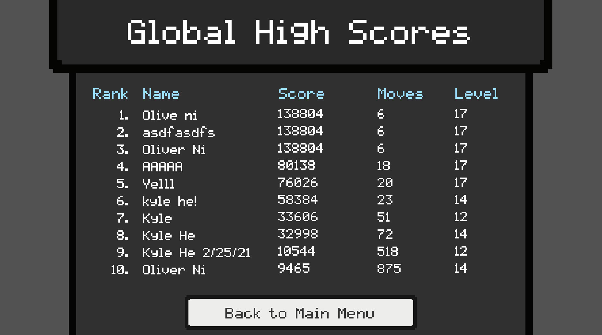

# Unus Motus

This game was created by Oliver Ni (11) and Kyle He (11) to compete in the FBLA Computer Game & Simulation Programming 2021 event.

The game itself is very self-explanatory and has in-game dialogue to guide you along the way, but we'll include instructions here in case.

## Play the game online
You can play the [game online here](https://keeelay.itch.io/unus-motus).

## Launching the game

This should be fairly simple; simply double click the file corresponding to your operating system. On Windows, click the `Unus Motus Windows.exe` file, and on macOS, click the `Unus Motus MacOS.app` file.

**Do NOT rename the executable file. If you do so, you will not be able to open it.**

You may be prompted to bypass a security setting. (This is not an issue with the game itself, but rather a feature of Windows we cannot bypass.) If you run into issues starting, click "More Info" and then click "Run Anyway" when prompted.

## Instructions (as shown in game)

WASD or arrow keys to move, space to toggle sticky characters, R to restart a level, and ESC to open settings. Use the mouse and click to press buttons in menus.

Certain characters can only move up and down, certain characters can only move left and right, and certain characters can only stick with other characters. (Hence the name *unus motus*, Latin for "one motion".)

The objective is to use teamwork to move all the characters to the exit in each level. In addition, there may be deadly lasers to avoid, buttons to turn off the lasers, crates to push out of the way, and more.

There are two different game modes: hardcore mode has 3 lives, a move counter and a leaderboard; casual mode has unlimited lives and a level select menu. There are 14 levels, each getting progressively harder.

(To the judges: Some levels may be very challenging, so in order to test the leaderboard, you may just move into a laser a couple times to end the hardcore run end prematurely, taking you to the end screen.)

## Multiplayer Functionality

In hardcore mode, there is an online leaderboard to submit your score. Score is calculated based on the number of moves you made and the level you reached.

## Code & Technical Details

The game is built with the [Unity Game Engine](https://unity.com/), a well-known tool for creating games. With over 1,000 lines of C# code, the game is very well-thought out and extensible. We went through several iterations of internal workings before this version.

The program is thoroughly documented using C#'s XML documentation feature, as well as normal comments throughout the code to explain what is going on.

Our (overengineered) backend for the global leaderboard is built using [Elixir](https://elixir-lang.org/), making it very scalable and fault-tolerant.

## Credits

**All art, effects, and UI elements are original.** We wanted to create the best game possible, so we created each sprite from scratch to fit in with the feel and mood of the game.

Music is created by [HeatlyBros](https://www.youtube.com/channel/UCsLlqLIE-TqDq3lh5kU2PeA). The music is royalty-free and we are permitted to use it in our game.

## Example Levels

## Example UI

