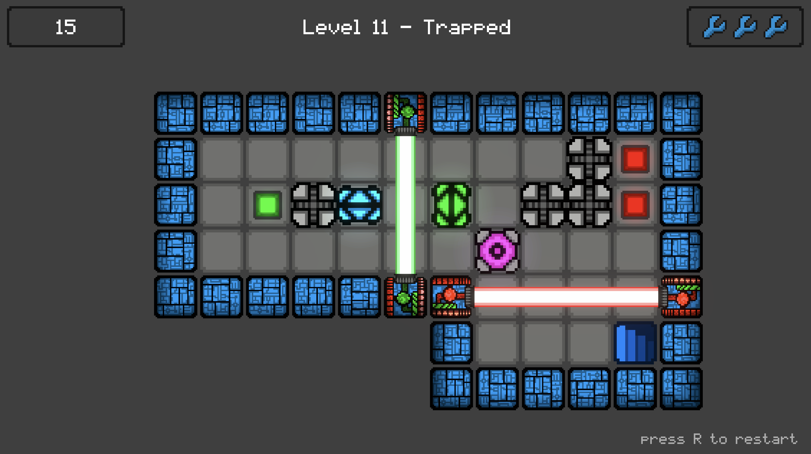
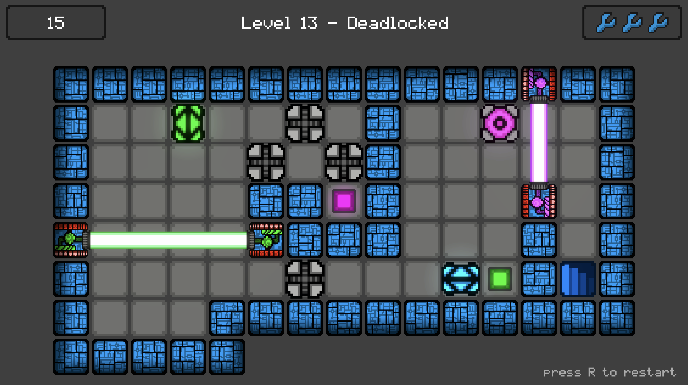
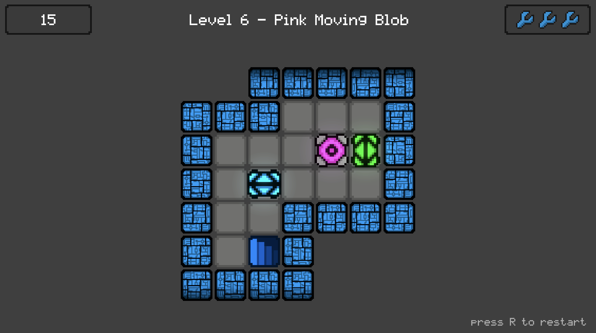
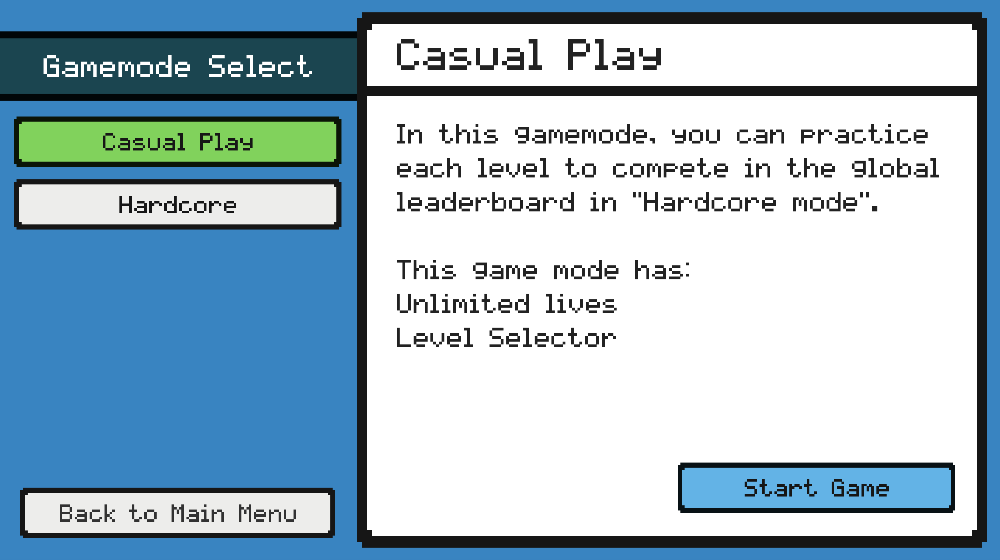
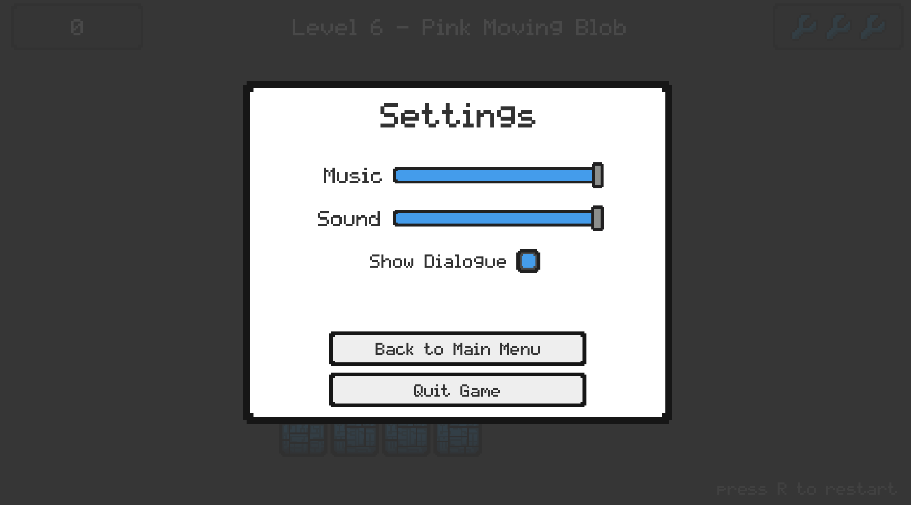
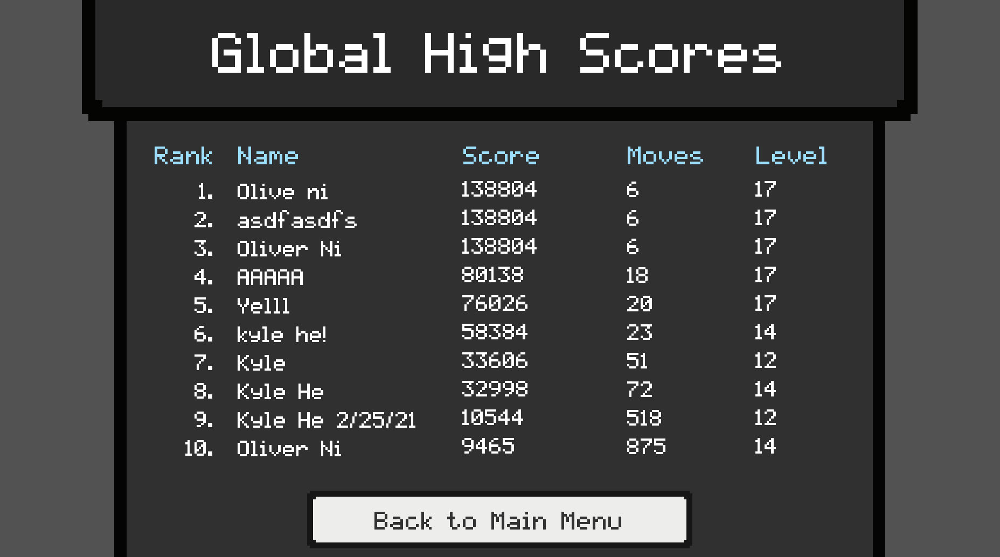

# Unus Motus

It is year 3021. You've just woken up.

After the Robot Wars of 2921, scientists put you and a few robotic companions into hibernation to preserve the human race. 

In the 100 years you've been asleep, a lot has happened. The facility you've been in seems to have decayed.

Thankfully, your robots are still partly functional. Let's get out of here.

[...]

This game was created by Oliver Ni (11) and Kyle He (11) to compete in the FBLA Computer Simulations and Programming 2021 competition.

### Instructions (as shown in game)

WASD or arrow keys to move, space to toggle sticky characters, R to restart a level, and ESC to open settings. 

### More

Certain characters can only move up and down, certain characters can only move left and right, and certain characters can only stick with other characters. (hence the name unus motus, latin for one motion)

There are two different game modes: hardcore mode has 3 lives, a move counter and a leaderboard; casual mode has unlimited lives and a level select menu. There are 14 levels, each getting progressively harder.

(To the judges: Some levels may be very challenging, so in order to test the leaderboard, you may just run into a laser a couple times to end the hardcore run prematurely in order to test the leaderboard)

### Multiplayer Functionality

In hardcore mode, there is an online leaderboard to submit your score. We built an (overengineered) scalable backend and API using [Elixir](https://elixir-lang.org/). Score is calculated based on the number of moves you made and the level you reached.

[ insert picture here ]

### Credits

All art, effects, and UI elements are original, created from scratch by us.

The game is built with the (Unity Game Engine)[https://unity.com/] and programmed using C#.

Music is created by [HeatlyBros](https://www.youtube.com/channel/UCsLlqLIE-TqDq3lh5kU2PeA). The music is royalty-free and we are permitted to use it in our game.

### Example Levels

### Example UI

